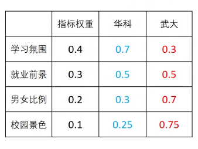
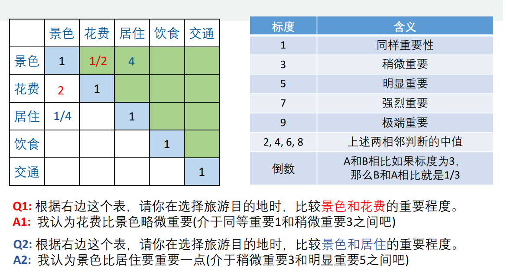
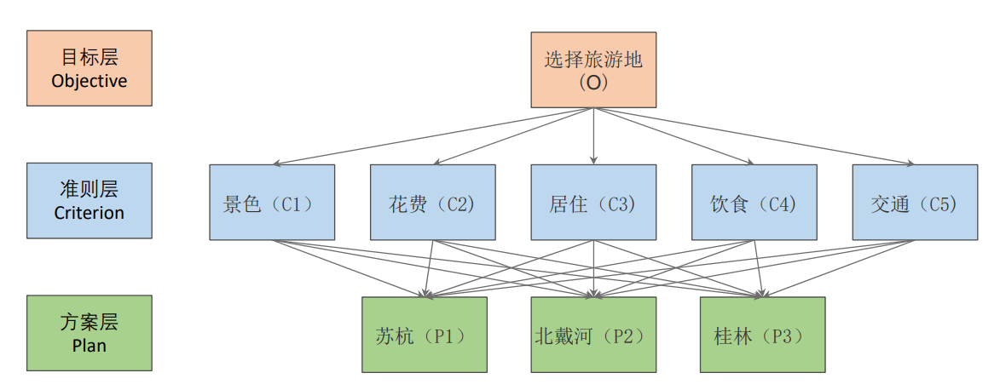
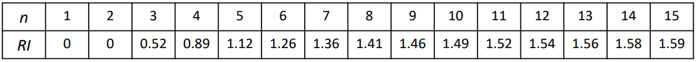
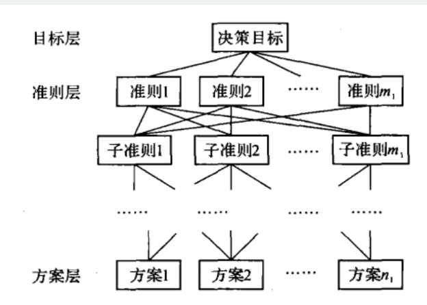
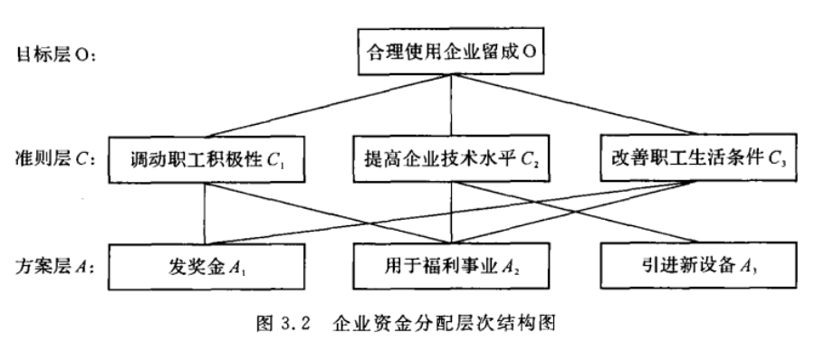
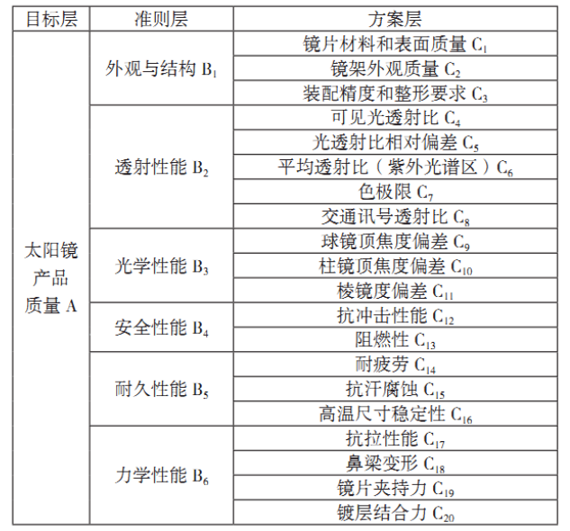

# 层次分析法

## 背景

- 目的

  用于解决评价类问题

  "给对象打分"

- 核心

  划分哪些层次

  层次的权重

  层次的打分

- 表格结构典例

  

  > 可以看到, 某个层次为 0.7, 0.3, 而不是 96, 97, 这种评分是二者相对比, 类似的也是方案的权重(而不是真正的分数)

- 结构

  确定评价指标, 形成评价体系, 选择评价方案

- 三段式思考

  - 我们评价的目标是什么？
  - 我们为了达到这个目标有哪几种可选的方案？
  - 评价的准则或者说指标是什么？（我们根据什么东西来评价好坏）

    通过别人的研究成果(论文)来进一步思考(谷歌,知网等)

- 直接权重的问题

  - 不易量化
  - 影响某因素的因子较多时

    考虑不周全、顾此失彼(今天的权重和明天的不同)

    甚至有可能提出一组隐含矛盾的数据

  - 解决方法

    分而治之, 没办法考虑多个因素的权重, 但可以考虑两两之间的相对权重, 最后转化

    

## 基本概念

- 正互反矩阵

  - $a_{ij}$表示的意义是，与指标 𝑗 相比，𝑖 的重要程度
  - $a_{ij} > 0$
  - $a_{ij} \times a_{ji} = 1$

  > 将正互反矩阵作为层次分析法中的`判断矩阵`

- 一致矩阵

  若正互反矩阵满足

  $$
  \begin{cases}
  a_{ij} = \frac {\text{i 的重要程度}} {\text{j 的重要程度}}  \\
  a_{jk} = \frac {\text{j 的重要程度}} {\text{k 的重要程度}}  \\
  \end{cases}
  \Rightarrow
  a_{ik} = \frac {\text{i 的重要程度}} {\text{k 的重要程度}}  = a_{ij} \times a_{jk}
  $$

  > 判断正互反矩阵是否为一致矩阵也称为一致性检验

  > 观察矩阵也容易发现, 行与行之间成比例
  >
  > 可以理解为, 第一列为`景色`作为参考系, 第二列以`花费`为参考系, 参考系之间的不同是比例因子的不同而已

## 模型

- 层次分析法(The Analytic Hierarchy Process 即 AHP)

  较合理地解决了定性问题定量化的处理过程

  主要特点是通过建立递阶层次结构，把人类的判断转化到若干因素两两之间重要度的比较上，从而把难于量化的定性判断转化为可操作的重要度的比较上面

  把复杂问题分解成多个组成因素，又将这些因素按支配关系分别形成递阶层次结构，通过两两比较的方法确定决策方案相对重要度的总排序

### 步骤

- 分析整体结构

  分析系统中各因素之间的关系，建立系统的递阶层次结构

  

  > 从下往上看, 是一个神经网络

- 构造判断矩阵

  对于同一层次的各元素关于上一层次中某一准则的重要性进行两两比较，构造两两比较矩阵(判断矩阵)

- [一致性检验](#一致性检验)

  由判断矩阵计算被比较元素对于该准则的相对权重, 并进行一致性检验(检验通过权重才能用)

- 输出结果

  根据权重矩阵计算得分, 并进行排序

### 一致性检验

- 目的

  完全的一致性是不大现实的, 经济性的是考虑理想程度

- 步骤

  - 计算一致性指标$CI$

    $$C I = \frac { \lambda _ { m a x } - n } { n - 1 }$$

    若为虚数, 则取模长

  - 查找对应的平均随机一致性指标$RI$

    

  - 计算一致性比例$CR$

    $$C R = \frac { C I } { R I }$$

    如果$CR < 0.1$, 则可认为判断矩阵的一致性可以接受; 否则需要对判断矩阵进行修正

    - 不符合的话, 如何修正

      观察行(列)与行(列)之间的关系

### 一致矩阵求权重

注意归一化

- 算术平均

  - 将判断矩阵按照列归一化
  - 将每行归一化的值求算术平均

  $$\omega _ { i } = \frac { 1 } { n } \sum _ { j = 1 } ^ { n } \frac { a _ { i j } } { \sum _ { k = 1 } ^ { n } a _ { k j } }$$

- 几何平均

  - 按照行相乘得到一个新的列向量, 并开方(几何平均)
  - 进行归一化即可

  $$\omega _ { i } = \frac { ( \prod _ { j = 1 } ^ { n } a _ { i j } ) ^ { \frac { 1 } { n } } } { \sum _ { k = 1 } ^ { n } ( \prod _ { j = 1 } ^ { n } a _ { k j } ) ^ { \frac { 1 } { n } } }$$

- 特征向量

  - 一致矩阵

    特征值 n 对应的特征向量为$k [\frac {1} {a_{11}}, \frac {1} {a_{12}}, \cdots, \frac {1} {a_{1n}}]$, 恰好一个为一致矩阵的第一列, 归一化即为权重向量

  - 类比

    - 求出矩阵 A 的最大特征值以及其对应的特征向量
    - 对求出的特征向量进行归一化

### 局限性

- 决策层不能太多

  评价的决策层不能太多，太多的话 n 会很大，判断矩阵和一致矩阵差异可能会很大

  表格中 n 最大为 15

- 针对数据已知较为无力

  如果决策层中指标的数据是已知的，那么我们如何利用这些数据来使得评价的更加准确呢？

  针对的是定性问题定量化的处理过程

## 模型拓展

- 多层次

  

- 部分权重为 0

  

  

## 课后练习

- 代码优化

  - 请对代码进行优化，例如输入判断矩阵 A 时，是否能自动检查矩阵 A 为正互反矩阵？
  - 如果我们输入的是一个二阶的判断矩阵，请观察结果有什么问题？怎么改进代码来修正这个问题。（提示：二阶判断矩阵一定是一致矩阵）

- 论文写作训练

  - 你要购置一台个人电脑, 考虑功能, 价格等因素, 如何做出决策
  - 为大学毕业的青年建立一个选择志愿的层次结构模型
  - 你的家乡准备集资兴办一座小型饲养场, 是养猪, 还是养鸡, 养兔......
