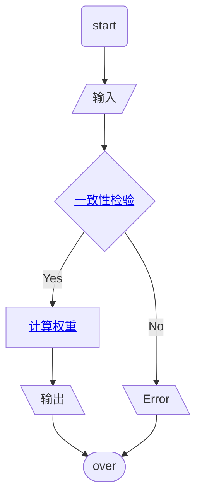
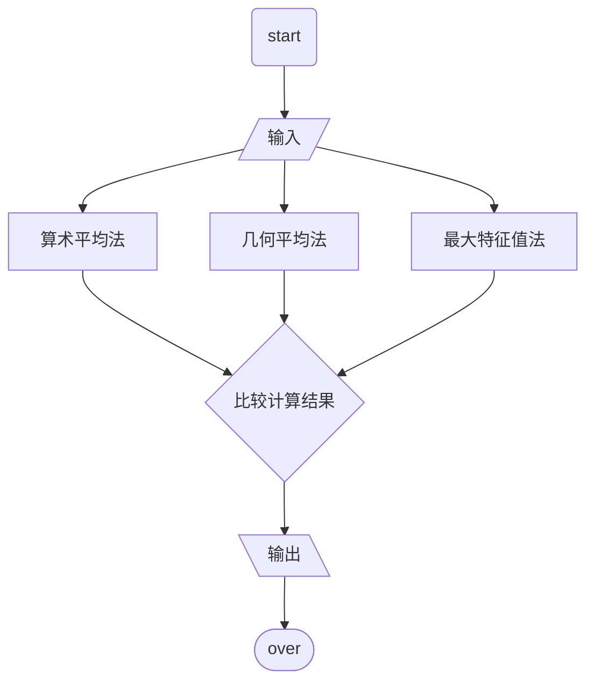

# 代码

## 基础

- 推荐阅读:[语言基础知识](https://ww2.mathworks.cn/help/matlab/language-fundamentals.html?s_tid=CRUX_lftnav)

- C 的基本集

  - 条件

    ```matlab
    if a >= 85
        disp('成绩优秀')
    elseif a >= 60
        disp('成绩合格')
    else
        disp('成绩挂科')
    end
    ```

    `end`结尾, 没有`:`(python 习惯)

  - 循环

    ```matlab
    for i = 1:10
        disp(i)
    end
    ```

    `end`结尾, 没有`:`(python 习惯)

  - 比较

    矩阵与常数比较, 返回的是布尔矩阵

    不等号`~=`, 而不是`!=`(C 语言习惯)

  - 运算

    - `^` => 幂运算

    - `/` => 对于矩阵是乘上矩阵的逆

    - `./`, `.*`, `.^` => 对每个元素运算

- I/O

  - 输入
    ```matlab
    a = input('请输入一个数字:')
    ```
  - 输出
    ```matlab
    disp(a)
    ```

- 分号

  - 分行
  - 显示与否

    加上分号, 不显示结果(disp 除外)

    不加分号, 会显示结果

- 矩阵

  - 行向量 => 逗号或空格
  - 列向量 => 分号

  - 访问

    ```matlab
    %  (1) 取某一个元素
    A(2,1)
    A(3,2)
    % (2)取指定的某一行的全部元素(输出的是一个行向量)
    A(2,:)
    % (3)取指定的某一列的全部元素(输出的是一个列向量)
    A(:,3)
    % (4)取指定的某些行的全部元素(输出的是一个矩阵)
    A([2,5],:)      % 只取第二行和第五行(一共2行)
    A(2:5,:)        % 取第二行到第五行(一共4行)
    A(2:2:5,:)     % 取第二行和第四行 (从2开始,每次递增2个单位,到5结束)
    A(2:end,:)      % 取第二行到最后一行
    A(2:end-1,:)    % 取第二行到倒数第二行
    % (5)取全部元素(按列拼接的,最终输出的是一个列向量)
    A(:)
    ```

- 字符串

  - 拼接

    - 字符串即是行向量

      ```matlab
      disp(['c的取值为' num2str(c)])
      disp(['c的取值为', num2str(c)])
      ```

    - `strcat`

- 注释

  - `%%` 可以分块

  - 注释 => `Ctrl+R`

  - 取消注释 => `Ctrl+T`

- 常用函数

  - `clear` => 清除工作区的所有变量

    常用于脚本开头

  - `clc` => 命令行窗口中的所有文本

    常用于脚本开头

  - `sum` => 求和

    ```matlab
    E = [1,2;3,4;5,6]
    % a=sum(x); %按列求和(得到一个行向量)
    a = sum(E)
    a = sum(E,1)
    % a=sum(x,2); %按行求和(得到一个列向量)
    a = sum(E,2)
    % a=sum(x(:));%对整个矩阵求和
    a = sum(sum(E))
    a = sum(E(:)) %拼接成列向量
    ```

    matlab 是按照行列页的级别来的, 如下

    $$
    \begin{bmatrix}
    1 & 4 \\
    2 & 5 \\
    3 & 6
    \end{bmatrix}
    $$

    先按行填满成一列, 列填满后是页

    - 猜测

      `dim = 1`是按照`A(:, 1, 1)`, `A(:, 2, 1)`

      `dim = 2`是按照`A(1, :, 1)`, `A(2, :, 1)`

  - `prod` => 乘积(product)
  - `repmat` => 重复复制

    ```matlab
    A = [1 2 3; 4 5 6]
    B = repmat(A, 3, 2)
    ```

    相当于分块矩阵

    $$
    B = \begin{bmatrix}
    A & A \\
    A & A \\
    A & A
    \end{bmatrix}
    $$

  - `size`

    ```matlab
    % size(A) 返回行向量
    [r,c] = size(A)
    r = size(A,1)  %返回行数
    c = size(A,2) %返回列数
    ```

  - [`find`](https://www.cnblogs.com/anzhiwu815/p/5907033.html)

    ```matlab
    % find函数,返回不为0的元素的位置索引
    ind = find(X)
    % 返回前2个不为0的元素的位置:
    ind = find(X,2)

    X = [1 -3 0;0 0 8;4 0 6]
    ind = find(X) % 返回的仍然是一维的索引
    % 这是因为在Matlab在存储矩阵时,是一列一列存储的,我们可以做一下验证:
    % 按行列输出
    [r,c] = find(X)
    [r,c] = find(X,1) %只找第一个非0元素
    ```

  - `eig`

    ```matlab
    % 阵A的特征值和特征向量的函数是eig(A)
    A = [1 2 3 ;2 2 1;2 0 3]
    % (1)E=eig(A):求矩阵A的全部特征值,构成向量E.
    E=eig(A)
    % (2)V的每一列都是D中与之相同列的特征值的特征向量
    [V,D]=eig(A)
    % 全部特征值,构成对角阵D
    % 特征向量构成V的列向量
    ```

## 代码主逻辑

- 输入: 比较矩阵
- 输出: 权重矩阵

  如果比较矩阵不合理, 则报错



### 一致性检验

- 输入: 正互反矩阵
- 输出: 是否一致

```mermaid
flowchart TD
    s(start)
    input[/输入/]
    check{$CR < 0.1$}
    cal_lambda[计算最大特征值$\lambda_{max}$]
    cal_CR[计算指标$CR$]
    output[\输出结果\]
    o([over])
    s --> input --> cal_lambda -- $\lambda_{max}$, 阶数n --> cal_CR --> check -- Yes -->  output --> o
    check -- No --> output
```

### 计算权重

- 输入: 近似的一致矩阵
- 输出: 权重矩阵



- 比较计算结果

  - 可以再次取平均
  - 如果有一个结果偏离其他两个结果,可以用来排除

## 代码实现

[](code_core.m ":include :type=code matlab")

## 代码技巧

- 充分利用矩阵, 同步计算 => 减少 for 循环

  比如将每列求和, `res = sum(A, 1);`

- 将一些角度转化到矩阵思考

  比如每个元素要除以整列的和, 可以先扩展求和后的向量为矩阵

  `sum_mat = repmat(sum_vec, [n, 1]);`
